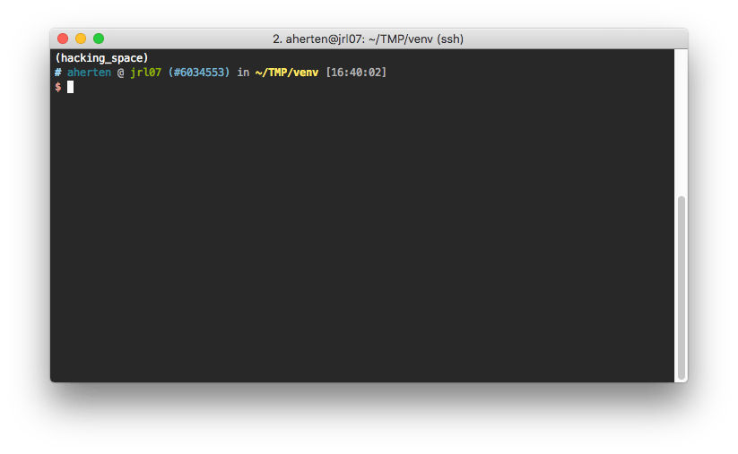

# oh-my-zsh Theme: ys for Clusters

This `ys-clusters` theme extends the [oh-my-zsh](https://github.com/robbyrussell/oh-my-zsh) default theme [`ys` by Yad Smood](http://ysmood.org/my-ys-terminal-theme/) with my needs for working with batch submission systems on large clusters.

## Modifications

1. Most importantly, it reads environment variables to determine the current job id.  
Currently supported are Slurm, LSF / IBM Spectrum LSF, PBS. Let me know if you need support for more.
2. It adds Virtualenv information (currently quite ugly)
3. The `$HOST` variable can be overridden by a `~/.box-name` file

## Installation

Put the `ys-cluster.zsh-theme` into `$ZSH/custom/themes/` and activate it by setting `ZSH_THEME="ys-cluster"` in your `~/.zshrc`.
